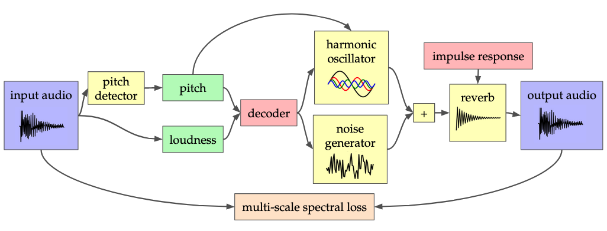

These are audio samples for Václav Volhejn's Master thesis, _Accelerating Neural Audio Synthesis_.
They showcase models that synthesize audio conditioned on pitch and loudness information.
Given an input audio, we first extract its pitch (melody) and loudness.
Then, given only these signals, the model tries to re-create the original sound.
By training the model on a dataset of somebody plays a violin, it learns to create violin sounds.

What is exciting about this is that if we have a violin model, we can use it to turn any sound into a violin (listen to the samples in "Violin timbre transfer" below).
Whatever sound we give the model—voice, trumpet, guitar—the model only cares about the pitch and loudness signals.
It then reconstructs the sound as if it were a violin.

The audio samples presented below were used in a subjective listening survey.
The meaning of the rows is:

- _Reference_ is the original audio file.
- _DDSP-full_ is a baseline model from [Engel et al.](https://arxiv.org/abs/2001.04643). About 6M parameters.
- _DDSP-CNN_ is our speed-optimized model (see thesis). About 300k parameters.
- _DDSP-CNN-Q_ is a version of DDSP-CNN quantized using static quantization.
- _DDSP-CNN-Tiny_ is a smaller speed-optimized model: it has **less than 2500 parameters**!
- _DDSP-CNN-Tiny-Q_ is a version of DDSP-CNN-Tiny quantized using static quantization.

## Violin timbre transfer

These models were trained on the same data as the [original DDSP](https://arxiv.org/abs/2001.04643) models, namely four violin pieces by John Gartner that are [accessible](https://musopen.org/music/13574-violin-partita-no-1-bwv-1002/) from the MusOpen royalty free music library\footnote.

The reference samples used are from xxxx.

VIOLIN_TT_SAMPLES

## Violin

These are the violin models from above, but this time they are used to reconstruct the original data.

VIOLIN_SAMPLES

## Trumpet

These models were trained on trumpet performances from the [URMP dataset](https://labsites.rochester.edu/air/projects/URMP.html).

TRUMPET_SAMPLES

